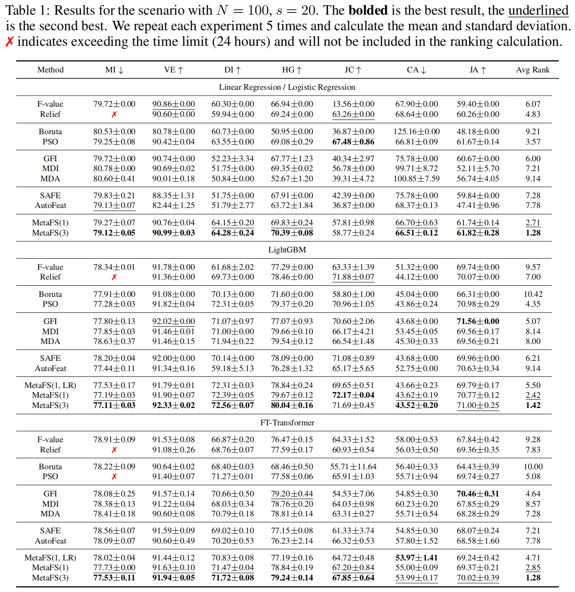
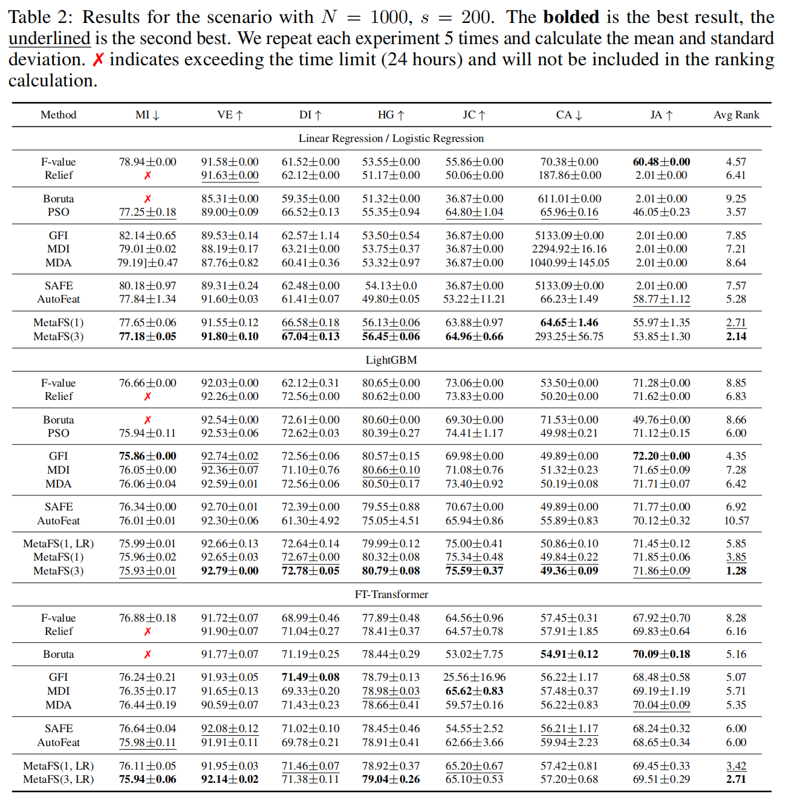

# MetaFS: Feature Selection with Meta-learner

## Installation

```bash
pip install -r requirements.txt
```

## Quick Example

A simple example of MetaFS using a dataset on OpenML.

```bash
cd examples
python openml.py
```

## Run experiments

### Prepare data

Download and process the required dataset from OpenML.

```bash
cd runs
python data_prepare.py --target_feature_num 50 --root_dataset_path ./dataset
```

### Run experiments

```bash
python method_compare.py --method_name MetaFS --model_name LogisticRegression
```

## Supplemental Results

The detailed results of each method on different datasets are shown in the following tables. All results in the table are multiplied by 100 for easier comparison.





